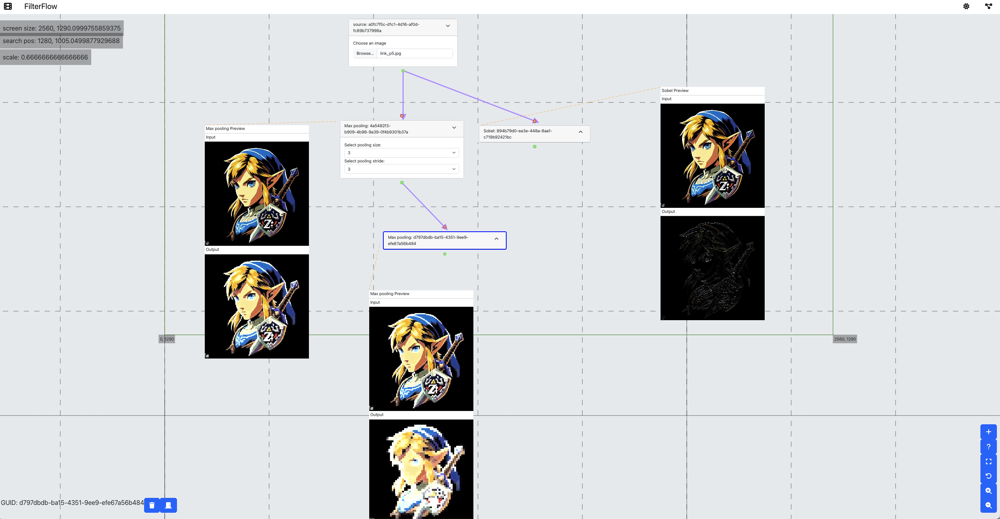

# FilterFlow

[FilterFlow](https://github.com/Roagen7/filterflow) is a web app for applying sequences of operations on an image. A tool for those interested in understanding filters better and applying simple operations on images. Heavily inspired by CyberChef.

## Usage
See [latest stable release](https://roagen7.github.io/filterflow/).

## Building
To build the project first install yarn
```
    npm install --global yarn
```
then the rest of the dependencies
```
    yarn install
```
after that
```
    yarn build
    yarn start
```

## Contribution guidelines
commit convention 
```
    ISSUE commit_message
```
eg.
```
    KAN-1 added_readme
```

## Screenshots


